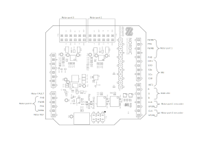

# Robot War Brushed DC motor driver shield for nRF52840 and newer 

### Series resistor
If the motors draw too much current for the motor drivers, they will enter an overcurrent protection state and will not start properly. Resistors R10, R18, R50 and R51 can be changed to ~10 Ohms.